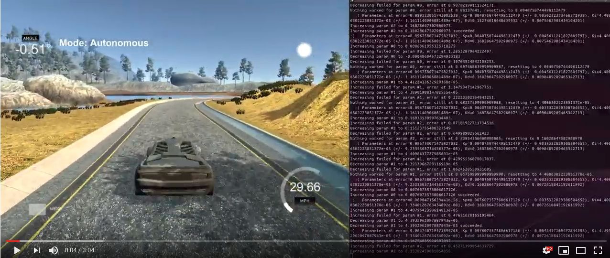

# CarND PID Controller

[](http://www.udacity.com/drive)

The goal of this project is to implement a PID controller that keeps the autonomous car
close to the center of the lane within a simulated environment.

A video of the final implementation running in a simulator can be 
found [here](https://www.youtube.com/watch?v=wSUsaHKEUBE). 

<a href="https://www.youtube.com/watch?v=wSUsaHKEUBE"></a>

---

## Dependencies

* cmake >= 3.5
 * All OSes: [click here for installation instructions](https://cmake.org/install/)
* make >= 4.1(mac, linux), 3.81(Windows)
  * Linux: make is installed by default on most Linux distros
  * Mac: [install Xcode command line tools to get make](https://developer.apple.com/xcode/features/)
  * Windows: [Click here for installation instructions](http://gnuwin32.sourceforge.net/packages/make.htm)
* gcc/g++ >= 5.4
  * Linux: gcc / g++ is installed by default on most Linux distros
  * Mac: same deal as make - [install Xcode command line tools]((https://developer.apple.com/xcode/features/)
  * Windows: recommend using [MinGW](http://www.mingw.org/)
* [uWebSockets](https://github.com/uWebSockets/uWebSockets)
  * Run either `./install-mac.sh` or `./install-ubuntu.sh`.
  * If you install from source, checkout to commit `e94b6e1`, i.e.
    ```
    git clone https://github.com/uWebSockets/uWebSockets 
    cd uWebSockets
    git checkout e94b6e1
    ```
    Some function signatures have changed in v0.14.x. See [this PR](https://github.com/udacity/CarND-MPC-Project/pull/3) for more details.
* Simulator. You can download these from the [project intro page](https://github.com/udacity/self-driving-car-sim/releases) in the classroom.

Fellow students have put together a guide to Windows set-up for the project [here](https://s3-us-west-1.amazonaws.com/udacity-selfdrivingcar/files/Kidnapped_Vehicle_Windows_Setup.pdf) if the environment you have set up for the Sensor Fusion projects does not work for this project. There's also an experimental patch for windows in this [PR](https://github.com/udacity/CarND-PID-Control-Project/pull/3).

## Basic Build Instructions

1. Clone this repo.
2. Make a build directory: `mkdir build && cd build`
3. Compile: `cmake .. && make`
4. Run it: `./pid`. 

Tips for setting up your environment can be found [here](https://classroom.udacity.com/nanodegrees/nd013/parts/40f38239-66b6-46ec-ae68-03afd8a601c8/modules/0949fca6-b379-42af-a919-ee50aa304e6a/lessons/f758c44c-5e40-4e01-93b5-1a82aa4e044f/concepts/23d376c7-0195-4276-bdf0-e02f1f3c665d)

## Project summary

This project only implements a single PID controller for the cross-track error, i.e. the
difference between the car's actual and expected trajectory, the center of the lane.

The PID controller consists of three supporting and/or adversarial components that work together
to reduce the observed error:

- The **proprotional** (**P**) component yields a control output that is proportional to the error;
  the higher the error, the higher the control output will be. 
  It only observes the current state of the system and only reacts to the current situation, always.
  Increasing the coefficient `Kp` of this component would result in faster reduction of error, but risks
  overshooting and constant oscillation; if the coefficient is too high, the system will become unstable
  up to a point where recovery is impossible.
- The **integral** (**I**) component integrates all previous errors and thus takes into account past states
  of the system. 
  If the system to be controlled has a systemic error, such as car on a circular road,
  where each new coordinate would be off by from the current coordinate by a fix amount,
  the proportional component would be always off by at least the same amount.
  By integrating the errors, the **I** controller is able to counter the systemic error of the
  **P** controller. Since it builds up a running error and needs a negative error to reduce the
  tally, it tends to overshoot the target state. This effect can be steered by its appropriate
  coefficient, `Ki`.
- The **differential** (**D**) component observes the derivative of the current error and
  is thus able to predict the (immediate) future state of the system.
  Where **P** controller oscillates due to inertia of the system, the **D** controller is
  able to notice that a change in error now may result in overshooting; by subtracting the
  differential from the current control value, it allows to smoothly approach the target value.
  Its coefficient `Kd` allows to steer between under- and overdampening (i.e. slow approaching
  or fast attack with dampened oscillation) or critically dampening the system (i.e. 
  dampening "just right" to minimize overshoot).
  
In order to find the optimal coefficients `Kp`, `Ki` and `Kd`, a combination of systematic
"guesstimation" and applying a stochastic variant of a coordinate ascent algorithm ("Twiddle")
was applied. The rule of thumb for initializing the parameters was to:

- Let the car drive along the track,
- Increase the proportional `Kp` such that stable oscillation around the center of the track occurred,
- Increase the differential `Kd` such that oscillation died out,
- Increase the integrating `Ki` such that systemic biases were reduced.

When oscillation was too strong, `Kd` was reduced by a factor of 66%; after that, the process was
repeated.

With the parameters found in this way, the "Twiddle" algorithm was initialized in order to
fine-tune onto a better set of values. It was implemented as a finite state machine in `Twiddle.h`/`.cpp`
that collects error data for a given time period, tunes a value according to a stochastic search interval,
commits the change if it yielded a smaller control error or reverts it, then selects a new parameter
and starts over.

The values found this way were

- `Kp = 0.011849068327946135 ± 0.0019829846121568401`
- `Ki = 4.3864069971145935e-05 ± 3.4970847752324867e-08`
- `Kd = 0.15786445727670606 ± 0.0023786438737016182`

These values result in a controller that keeps the car well on the track,
but reacts heavily to disturbances. This would not be suitable for a nice driving experience,
but then again, the whole controller is a bit too simple for an actual self-driving car.

I was hoping to bias the controller towards a slower attack (i.e., proportional coefficient)
as I assume it is much less of a problem if the car arrives at the lane center slower rather
than faster. This is especially true in curves where "sharp" steering commands would yield
a high lateral acceleration and jerk.
As mentioned already, a more complex solution that would take into account multiple sensors,
such as a MISO, state-space or model predictive and neural controllers would be beneficial for an actual car.

The project was fun though and seeing the controller's output on a simulated race track
rather than a graph was a nice experience.
